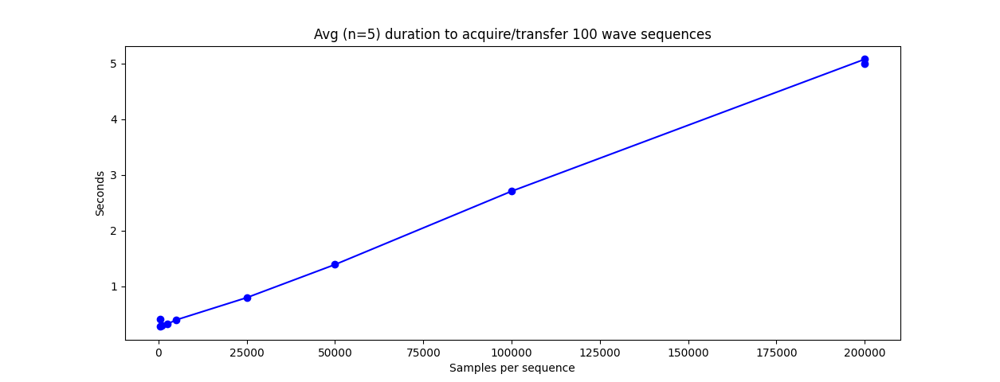
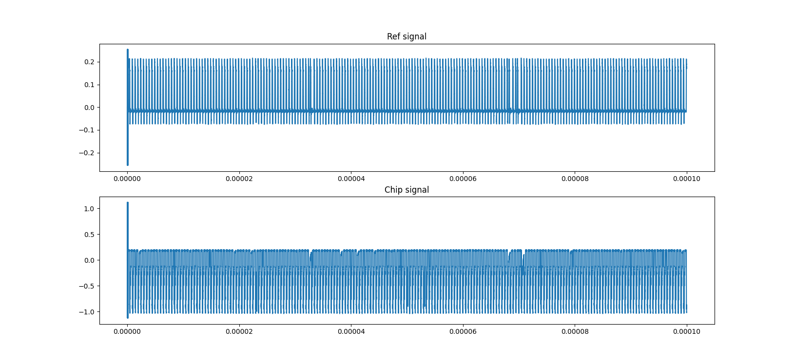
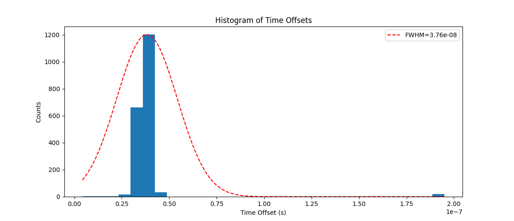
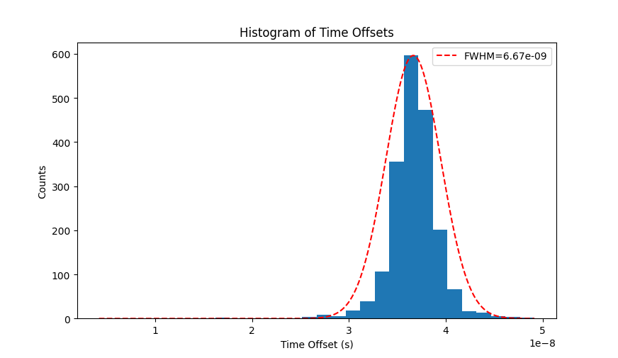

# 
 Automated Jitter Measurement  Documentation 
 

This code is designed to run with Teledyne LeCroy MAUI™ oscilloscopes. The primary intent is to have a set of functions that simplifies the running of jitter measurements. Specifically, a situation where two signals have corresponding edge events with varying time offsets. The jitter is the variation in these offsets over the course of many trigger events.

Here we outline an overview of connecting the scope and the code functionality.

## Connecting the scope with PC
The scope should be connected to the PC via ethernet on a local network. We additionally used a switch as an intermediate between the PC and scope. Proper connectivity should be confirmed by first pinging the scope from the PC and then attempting to ping the PC from the scope.

### Disable firewall
An important note is that the default scope settings have a firewall enabled that prevents other devices on the local network from interfacing with it. To bypass this you must disable these settings (via the standard Windows 10 interface), which requires admin credentials. By default these are 

 Username: LCRYADMIN 
 

 Password: SCOPEADMIN 
 

### IP address
When the scope is connected to a local network it will have a distinct IP address. This can be found either by typing "ipconfig" in the windows command line, or in the native scope software by going to Utilities > Utilities Setup > Remote. The IP address should be displayed. 

You will know the scope and PC are properly connected if you can add and see the scope on NI Max under "Network Devices".

### Control Drivers
There are two drivers that can be used to remotely control the scope through python. These are the VISA driver and the ActiveDSO driver. They both work to rovide an interface to transfer data between the PC and scope. 

The `MAUI.py` file is written to work through ActiveDSO. For this to work you must install the ActiveDSO software. A guide can be found [here.](https://www.teledynelecroy.com/doc/using-python-with-activedso-for-remote-communication) This will require a Teledyne Lecroy account. It will take a few buisiness days to get approval if you're registering one for the first time. 

With that being said, VISA has all the same functionality and in some cases may already be installed on the PC. The syntax is quite similar for the two drivers, and re-writing `MAUI.py` to work with VISA shouldn't be overly convoluted (just a little annoying perhaps).

## Scope Interfacing Files
Once you've connected to the scope through the appropriate interface, you may begin sending commands. The full documentation for remote control can be found [here](https://www.mouser.com/pdfDocs/maui-remote-control-and-automation-manual.pdf?srsltid=AfmBOopTUiOzCRKhMw20rTQm8g4ExqgGg3dFMqV92nIm03f7aezunvxA). 

The `MAUI.py` file contains a class that streamlines the connection and control processes outlined in the manual. As mentioned earlier, it will not work without ActiveDSO installed. 

The `scope_script_MDP.py` file utilizes the class defined in `MAUI.py` for higher level functions directly designed with jitter measurements in mind.

The `main.py` file uses functions from `scope_script_MDP.py` to outline a protocol that includes adjusting the chip parameters through a connected arduino.

## Important Notes about Acquisition with Scope
The scope supports a variety of modes for acquiring data. In our case, where we want to acquire many waveforms and send all of them to the PC, the best option is sequence mode. With this you set a number of waveform segments to acquire (when they're triggered) and the scope stores them all in local memory until all the data has been collected. Afterwards you can extract all the waveforms together in one numpy array. 

With this in mind, here are some particular scope-related quirks we've come across that are worth flagging.

### Setting samples per acquisition 
The maximum number of samples acquired in each acquisition segment can be set manually. However the scope will convert this to the nearest (lower) acceptable value. The specific maximum allowed sample value is limited by memory constraints and internal settings. 

For example, if you set the number of acquisitions per sequence to be `N=10000`, the allowed maximum number of samples per acquisition will likely be much lower than with a smaller number of acquisitions.

You can find the true number of samples per acquisition from the output of `MAUI().query("""VBS? 'return=app.acquisition.horizontal.maxsamples'""")` using the class from the `MAUI.py` file.

The time it takes to get data in sequence mode depends on a number of factors. However a general sense can be gained from the plot below. Each acquisition was taken over a 10 $\mu\text{s}$ window, and 100 acquisitions were taken per sequence:

Note: This only accounts for the time to extract data from the scope as a numpy array. It does NOT include the time it takes to store the wave data to the PC

Another important metric to keep in mind with regards to samples per sequence is memory. We found that, when storing 100 sequences of 10,000 samples as a CSV file, it was around 50 KB of data.

### First segment acquisition irregularity
When collecting waveform data in sequence mode, we noticed that the first acquisition always has unusual spiking behavior in the beginning. The sequence below shows this:

This spiking obviously messes with our ability to process the data. For this reason, we have a parameter in our `get_offsets()` function that species how many samples to clip out from the beginning. We set this by default to `num_samples`, which is the number of samples per individual waveform acquisition. This removes the anomalous behavior from the beginning. 

### Extreme Outlier Data
As you may have noticed above, the AWG will sometimes skip or bunch pulses together in a way that leads to very uncharacteristic outlier data. This can cause plots that look like this:

The outlier data seen on the far right is present in basically every measurement we do. We're not sure where it comes from, but it messes with our FWHM calculation.

If we take the same dataset, but then omit any data more than 4 standard deviations away from the mean, we get the following plot:

The counts have changed between the two figures because the bins have been reconfigured. As you can see, the FWHM in the latter examples is much more characteristic of the normal distribution.